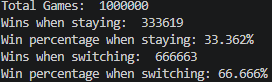

# Monty Hall Simulation

This project is a Python simulation of the Monty Hall problem, a probability puzzle based on a game show scenario.

In the problem, a contestant chooses one of three doors. Behind one door is a prize, and behind the other two doors are goats. After the contestant makes an initial choice, the host, Monty Hall,  opens one of the losing doors. The contestant then has the option to stay with their original choice or switch to the remaining unopened door.

## Project Goal

The goal of this simulation is to compare both strategies over many repeated games:

- Staying with the original choice
- Switching after the host opens a losing door

The simulation shows that switching wins more often, usually close to **2/3 of the time**, while staying wins close to **1/3 of the time**.

## What I Practiced

- Python functions
- Random selection
- Lists
- Loops
- Conditional logic
- Basic probability simulation

## How to Run

```bash
python monty_hall.py

## Sample Output


